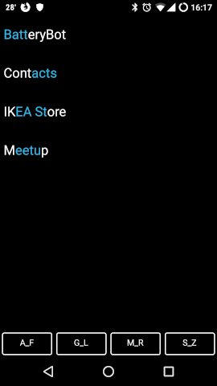

# T4 Launcher

Android Launcher simply consisting of a scrollable list af apps with [predictive text](https://en.wikipedia.org/wiki/Predictive_text) filtering using 4 Buttons.

_Example for input `[A_F][A_F][S_Z][S_Z]`_
- short press launches app
- long press opens app settings
- back button removes last input
- home button clears input

_This is basically a rewrite of [minimalistic-launcher](https://github.com/Collinux/minimalist-launcher) in Kotlin with added functionality._